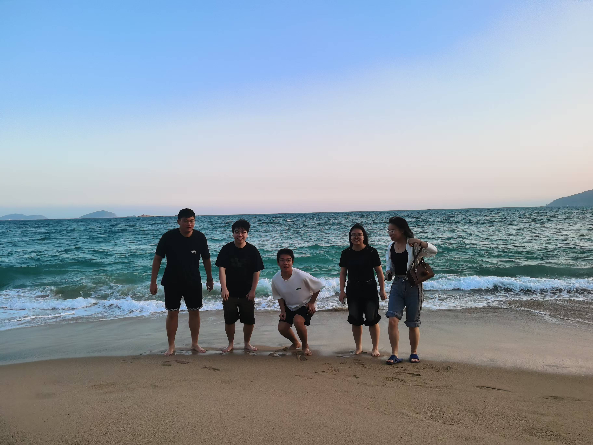
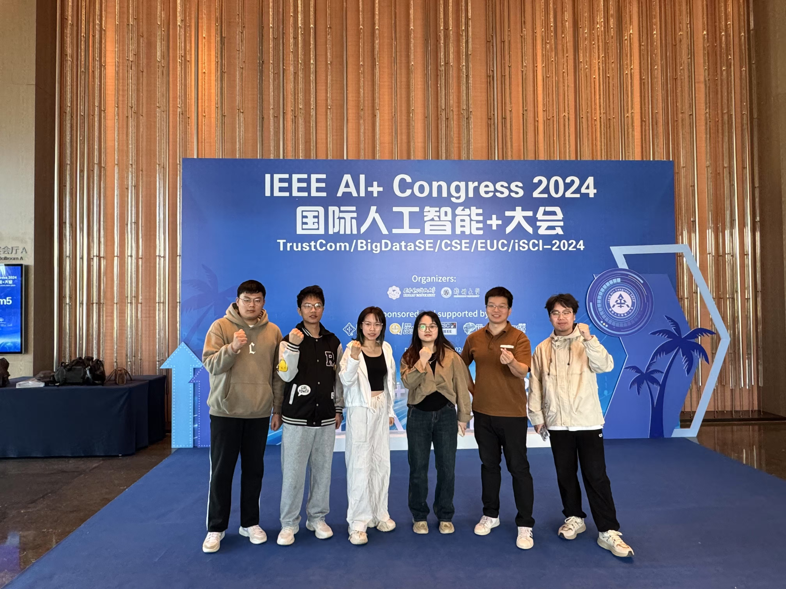


# USC_IDC实验室🚀️ 
本实验室研究团队致力于云计算安全、区块链与人工智能安全、密码学分析以及并行与分布式计算等前沿领域的研究。实验室的研究不仅注重基础理论的突破，也强调实际应用的推动，尤其是在信息安全和计算效率的提升方面。实验室的成员们参与并推动了多个国际知名期刊与会议的学术论文发表，涵盖了云计算、区块链技术、人工智能算法等多个交叉学科领域。实验室的研究成果已在如《TDSC》、《IOTJ》、《JPDC》、《TrustCom》、《IPCCC》等国内外权威期刊与会议上发表，并多次获得奖项，其中包括IEEE TrustCom 2018会议最佳论文奖。

本小组是 **南华大学计算机学院田纹龙副教授** 带领的一个专注大数据安全的研究小组。本小组的研究方向包括但不限于以下几部分：

**研究方向：**

* 云计算安全
* 区块链与人工智能安全
* 密码学分析
* 并行与分布式计算
* DNA存储

# 新闻🎉️

* 【2025-01】 我们的论文“High-Performance and Secure Jaccard Similarity Estimation for Cloud Storage”被The 16th ACM/SPEC International Conference on Performance Engineering (WWW Companion ’25)接收为short paper **（CCF-A顶级会议）** 录用。
* 【2024-11】我们的论文“IBNR-RD: Intra-Block Neighborhood Relationship-Based Resemblance Detection for High-Performance Multi-Node Post-Deduplication”被IEEE Transactions on Cloud Computing（TCC）接收 **（中科院二区）**。
* 【2024-11】我们的论文“Who Owns the Cloud Data? Exploring a non-interactive way for secure proof of ownership .”被The IEEE TrustCom-2024 **（CCF-C会议）** 接收。
* 【2024-11】我们的论文“Sec-Reduce: SecureReduction of Redundant and Similar Data for Cloud Storage based on Zero-Knowledge Proof .”被The IEEE TrustCom-2024 **（CCF-C会议）** 接收。
* 【2024-10】谢志雄， 何浈锐，池雨萱在第五届湖南省研究生人工智能创新大赛荣获**省级三等奖**。
* 【2024-10】谢志雄， 何浈锐，池雨萱在第三届湖南省研究生计算机创新大赛荣获**省级二等奖**。
* 【2024-10】 曾德文，阳智欢在在第五届湖南省研究生人工智能创新大赛荣获**省级二等奖**。
* 【2024-10】曾德文，阳智欢在第三届湖南省研究生计算机创新大赛荣获**省级二等奖**。
* 【2023-11】阳智欢，曾德文，谢志雄在第四届湖南省研究生人工智能创新大赛荣获**省级二等奖**。
* 【2023-10】我们的论文“上下文语义嵌入的变粒度云存储相似数据去重技术”被计算机技术与发展 **（CCF-C中文期刊）** 接收
* 【2022-10】阳智欢在第一届湖南省研究生计算机创新大赛荣获**省级三等奖**。

# 团队成员😄
## **在读硕士生**

| ==&zwnj;**年级**&zwnj;==  | 姓名 |
|----------------|---------------------|
| ==&zwnj;**研三**&zwnj;==  | [阳智欢](#阳智欢) |
| ==&zwnj;**研二**&zwnj;==  |[曾德文](#曾德文), [谢志雄](#谢志雄)|
| ==&zwnj;**研一**&zwnj;==  |[池雨萱](#池雨萱)，[何浈锐](#何浈锐)|

###    阳智欢 (Zhihuan Yang)
***个人简介：***
阳智欢目前正在南华大学攻读硕士学位研究生三年级。她的主要研究兴趣包括云计算安全和分布式安全。
***发表学术论文：***
[1] 阳智欢，田纹龙，何婷婷，叶旭明，唐佳，上下文语义嵌入的变粒度云存储相似数据去重技术，计算机技术与发展,2024（已录用，CCF-C推荐期刊）
[2] Zhihuan Yang，Wenlong Tian，Ruixuan Li，Xuming Ye，Zhiyong Xu. Who Owns the Cloud Data? Exploring a non-interactive way for secure proof of ownership .The 23rd IEEE International Conference on Trust, Security and Privacy in Computing and Communications（已录用，The IEEE TrustCom-2024,CCF-C会议)
[3] Zhihuan Yang，Wenlong Tian，Emma Zhang， Zhiyong Xu. c The 23rd IEEE International Conference on Trust, Security and Privacy in Computing and Communications（已录用，The IEEE TrustCom-2024,CCF-C会议)
***获奖列表：***
 - 2024年研究生国家奖学金 
 - 第四届湖南省研究生人工智能创新大赛二等奖 
 - 第五届湖南省研究生人工智能创新大赛二等奖
 - 第三届湖南省研究生计算机创新大赛二等奖 
 - 2022-2023年研究生校级一等奖学金
 - 2023-2024年研究生校级二等奖学金
 - 研究生校级新生三等奖学金 等奖（排一）
 -  2023 年校级优秀研究生干部

##

###    谢志雄 (Zhixiong Xie)
***个人简介：***
谢志雄目前正在南华大学攻读硕士学位研究生二年级。他的主要研究兴趣包括云计算安全和分布式安全。

***发表学术论文：***
High-Performance and Secure Jaccard Similarity Estimation for Cloud Storage Zhixiong Xie, Wenlong Tian*, Jianfeng Lu, Weijun Xiao, and Zhiyong Xu. 2025. High-Performance and Secure Jaccard Similarity Estimation for Cloud Storage. In Companion of the 16th ACM/SPEC International Conference on Performance Engineering (WWW ’25), April 28-May 2, 2025, Sydney, NSW, Australia. ACM. https://doi.org/10.1145/3701716.3715588 （CCF-A）

***获奖列表：***
比赛证书编号，参与人员列表，参赛题目，第四届湖南省研究生人工智能创新大赛二等奖, pdf
第五届湖南省研究生人工智能创新大赛三等奖
第三届湖南省研究生计算机创新大赛二等奖
##

###    曾德文 (Dewen Zeng)

***个人简介：***
曾德文目前正在南华大学攻读硕士学位研究生二年级。他的主要研究兴趣包括云计算安全和分布式安全。

***发表学术论文：***
IBNR-RD: Intra-Block Neighborhood Relationship-Based Resemblance Detection for High-Performance Multi-Node Post-Deduplication（中科院二区）

***获奖列表：***
第四届湖南省研究生人工智能创新大赛二等奖
第五届湖南省研究生人工智能创新大赛二等奖
第三届湖南省研究生计算机创新大赛二等奖
##

###    何浈锐 (Zhenrui He)

***个人简介：***
何浈锐，计算机学院2024级电子信息专业硕士研究生。在计算机学院学生第四党支部中担任宣传委员，为支部的各种活动撰写新闻稿。学习上，我积极完成导师布置的科研任务，认真学习专业相关的知识。生活中，我是一个比较随和的人，热爱运动，享受运动给我带来的快乐。

***发表学术论文：***

***获奖列表：***

 - 第五届湖南省研究生人工智能创新大赛三等奖
 -  第三届湖南省研究生计算机创新大赛二等奖
 - 研究生新生校级二等奖学金

##

###    池雨萱 (Yuxuan Chi)

***个人简介：***
池雨萱目前正在南华大学攻读硕士学位研究生二年级。她的主要研究兴趣包括云计算安全和分布式安全。
***发表学术论文：***

***获奖列表：***

 - 第五届湖南省研究生人工智能创新大赛三等奖
 -  第三届湖南省研究生计算机创新大赛二等奖
 - 研究生新生校级二等奖学金
 
 # 照片墙❤️

| 图片1 | 图片2 | 图片3 | 图片4|
|-------|-------|-------|-------|
|  |  |  |  |

 

# 论文推荐&数据集👀️  

